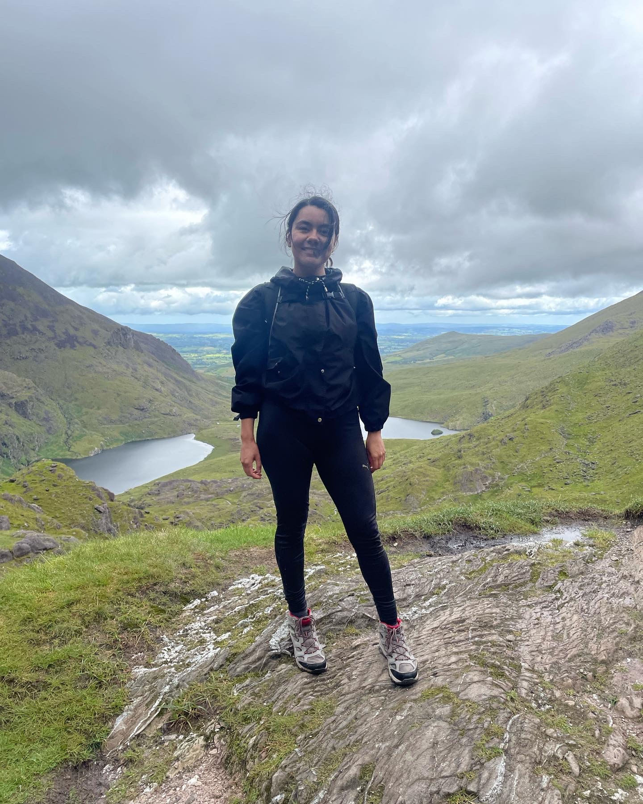

## Who I Am

I am a results-oriented Master's student in Ireland specialising in **Business Analytics and AI-driven business solutions**. My work sits at the intersection of international trade and advanced analytics - translating complex data into strategic insights that inform real decisions.

My professional perspective is built upon a foundation in International Trade and Business, further enriched by practical experience in high-volume commercial environments. During my time in customer-facing and operational roles, I developed an acute understanding of how supply chain dynamics, pricing fluctuations, and seasonal trends directly influence consumer behaviour. This firsthand observation of market variables served as the catalyst for my transition into advanced analytics.

I am currently refining my technical proficiency in Python, SQL, and Business Intelligence tools to translate complex datasets into actionable business intelligence. My goal is to combine my international business background with rigorous quantitative analysis to help organisations bridge the gap between global strategy and localised operational impact.

::: {.callout-note}
## At a glance
- **Current programme:** MSc Business Analytics, **Dublin City University** (Expected 2026)
- **Prior education:** BSc in International Trade and Business, Universidad de Sonora (Mexico)
- **Target roles:** Business Intelligence, Data Analysis, NLP Applications
- **Languages:** English (Advanced/C1 - IELTS Band 7), Spanish (Native)
- **Based in:** Dublin, Ireland
- **LinkedIn:** [lilian-cordova-hernandez](https://www.linkedin.com/in/lilian-cordova-hernandez-916a37232)
:::

## What I Do

I apply data science techniques — particularly **Natural Language Processing (NLP)** and **Machine Learning** — to business problems. My recent work has focused on financial sentiment analysis, LLM-enabled content pipelines, and supply chain digitalisation. I am most energised when a technical project connects back to a concrete strategic question.

## Technical Skills

| Category | Tools & Technologies |
|----------|---------------------|
| **Programming** | Python (Scikit-learn, Pandas, NLTK), SQL |
| **Machine Learning** | Random Forest, Gradient Boosting, Sentiment Analysis, TF-IDF Vectorisation |
| **Business Intelligence** | Advanced Microsoft Excel (KPI tracking, reporting tools), Power BI, Tableau |
| **Web & Publishing** | Quarto, HTML/CSS, Git, GitHub Pages |

## Academic Focus

My MSc programme at **Dublin City University** centres on applying analytics directly to business problems:

- **Applied Business Analytics** — statistical methods and analytical frameworks for business decision-making
- **Machine Learning for Business** — supervised and unsupervised methods with applied case studies
- **Strategic AI Integration** — how organisations deploy AI effectively within existing operations

**Applied research:** I developed an [LLM-enabled content production pipeline](projects/list/ai_content_pipeline.qmd) to optimise workflow efficiency for a retail client — a project that combined my interest in language models with the operational challenges of a real business. 

## Professional Background

**Florería y Regalos Martha** — Customer Service / Social Media (Hermosillo, Mexico, Feb–May 2025)

In this role I managed inventory and logistics for a retail environment, improving service delivery efficiency. I also developed commercial awareness through direct customer interaction and social media management. It was in positions like this that I first noticed the patterns in customer behaviour that would later draw me toward analytics as a discipline.

## Goals

::: {.callout-tip}
## Where I am heading
1. **Short term:** Complete the MSc Business Analytics programme at DCU and build a portfolio of analytical work that demonstrates genuine technical depth in NLP and machine learning.
2. **Medium term:** Secure a role in **Business Intelligence** or **Data Analysis**, ideally at a company operating across international markets where my bilingual and cross-cultural background adds value.
3. **Long term:** Become a bridge between strategic decision-making and quantitative analysis — helping organisations make better choices with better evidence.
:::

## Continuous Professional Development

In addition to my formal programme at DCU, I have completed a structured set of online courses to strengthen my technical foundation in data analytics and AI. Selected highlights below, organised by area.

### Data & AI

| Area | Course |
|------|--------|
| **AI Fundamentals** | Introduction to Generative AI |
| **AI Fundamentals** | Large Language Models |
| **AI Fundamentals** | Prompt Engineering |
| **AI Fundamentals** | Advanced Prompt Concepts |
| **AI Fundamentals** | Exploring ChatGPT |

### SQL & Python

| Area | Course |
|------|--------|
| **Python Fundamentals** | Python Fundamentals |
| **SQL** | Understanding SQL Databases |
| **SQL** | Selecting and Filtering Data with SQL |
| **SQL** | Joining Data with SQL |

### Data Ethics, Security & Communication

| Area | Course |
|------|--------|
| **Data Ethics & Risk** | Introduction to Data Ethics |
| **Data Ethics & Risk** | Applying Ethical Thinking in Data Ethics |
| **Data Security** | Keeping Your Information Safe |
| **Data Security** | Handling Data Securely and Responsibly |
| **Data Presentation Skills** | Communicating Data Effectively |
| **Data Presentation Skills** | Telling Stories with Data |
| **Data Presentation Skills** | Presenting Your Data |

### Research Integrity

- **Good Research Conduct Certificate** — Epigeum / Dublin City University. Comprehensive training covering research ethics, data management, authorship, and responsible conduct in academic research.

### Language Certifications

- **IELTS Academic** — Band 7 (Advanced / C1 English proficiency)

## Outside of Work

{width="35%" style="float:right; margin-left:1.5em; margin-bottom:0.5em; border-radius:6px;"} Most of my free time is spent hiking, and Carrauntoohil, Ireland's highest peak, is the climb that has stayed with me the most. I'm drawn to travel and the outdoors more broadly: I've cycled El Camino de la Muerte in Bolivia, spent time in the Andes, and stood on the salt flats of the Salar de Uyuni.

I joined DCU's swimming club when I started the Masters, as a beginner rather than a competitor, and I've also taken ocean swimming lessons to keep learning. Running and yoga, the latter a practice I've maintained since I was 20, round out how I spend my time away from screens.

## Interests

- Applications of **Natural Language Processing** in financial and commercial contexts
- **Large Language Models** for business automation and workflow optimisation
- **Data storytelling** and effective communication of analytical results to non-technical audiences
- Cross-cultural and bilingual analytical contexts

## A Note on This Site

This portfolio was built with [Quarto](https://quarto.org/), styled with custom Sass, and deployed via GitHub Pages. The source code is [publicly available on GitHub](https://github.com/cordova-lilian/eportfolio) — take a look if you are curious about the implementation.