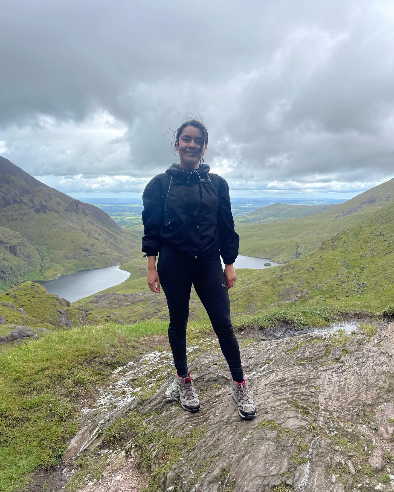

## Who I Am

I'm a Business Analyst whose path into analytics started in International Trade and Business at Universidad de Sonora, Mexico. After graduating, I spent four years in customer service and social media for a retail business in Hermosillo, where I managed inventory and logistics and saw first-hand how day-to-day commercial decisions play out on the ground.

That experience is what drew me to Dublin City University's MSc in Business Analytics, where I could build on a commercial background with technical skills in Python, SQL, machine learning, and Business Intelligence tools. I'm now looking for roles in Business Intelligence, Data Analysis, Business Consulting, or NLP, where I can combine that technical grounding with the analytical and client-facing skills covered on this site.

::: {.callout-note}
## At a glance
- **Programme:** MSc Business Analytics, Dublin City University, Second Class Honours, Grade 1 (2.1); conferral ceremony 19 October 2026
- **Prior education:** Bachelor of International Trade and Business, Universidad de Sonora (Mexico)
- **Target roles:** Business Intelligence, Data Analysis, Business Consulting, NLP
- **Languages:** English (Advanced/C1 - IELTS Band 7), Spanish (Native)
- **Based in:** Dublin, Ireland
- **LinkedIn:** [lilian-cordova-hernandez](https://www.linkedin.com/in/lilian-cordova-hernandez-916a37232)
:::

## What I Do

I apply data science techniques, particularly **Natural Language Processing (NLP)** and **Machine Learning**, to business problems. My recent work has focused on financial sentiment analysis and LLM-enabled content pipelines. I'm drawn to projects where a technical approach connects back to a concrete strategic question.

## Technical Skills

| Category | Tools & Technologies |
|----------|---------------------|
| **Programming** | Python (Scikit-learn, Pandas, NLTK), SQL |
| **Machine Learning** | Random Forest, Gradient Boosting, Sentiment Analysis, TF-IDF Vectorisation |
| **Business Intelligence** | Advanced Microsoft Excel (KPI tracking, reporting tools), Power BI, Tableau |
| **Web & Publishing** | Quarto, HTML/CSS, Git, GitHub Pages |

## Academic Focus

My MSc programme at **Dublin City University** centred on applying analytics directly to business problems:

- **Applied Business Analytics**: statistical methods and analytical frameworks for business decision-making
- **Machine Learning for Business**: supervised and unsupervised methods with applied case studies
- **Strategic AI Integration**: how organisations deploy AI effectively within existing operations

**Applied research:** As part of a six-person consultancy team, I worked on an [LLM-enabled content production pipeline](projects/list/ai_content_pipeline.qmd) to optimise workflow efficiency for a retail client (name withheld for confidentiality). My own contributions were the project's systematic literature review and the stakeholder interviews that helped shape the team's recommended build, a project that combined my interest in language models with the operational challenges of a real business.

## Professional Background

**Florería y Regalos Martha**: Customer Service / Social Media (Hermosillo, Mexico, February 2020 – March 2024)

In this role I managed inventory and logistics for a retail environment, improving service delivery efficiency. I also developed commercial awareness through direct customer interaction and social media management. It was in positions like this that I first noticed the patterns in customer behaviour that would later draw me toward analytics as a discipline.

**Consultoría Especializada de Sonora (COESSO)**: Consulting and Quality Management (Hermosillo, Mexico, January 2015 – June 2015)

Advised on workplace safety and health regulations imposed by STPS (Mexico's Labour Ministry) and Mexican Civil Protection, conducted emergency drills and brigade training courses, and supported environmental license reporting, risk diagnoses, and ISO quality-standard compliance work.

## Goals

::: {.callout-tip}
## Where I am heading
1. **Short term:** Secure a role in **Business Intelligence**, **Data Analysis**, **Business Consulting**, or **NLP**, ideally at a company operating across international markets where my bilingual and cross-cultural background adds value.
2. **Medium term:** Build on that first role to deepen my technical depth in NLP and machine learning, while taking on more client-facing analytical work.
3. **Long term:** Become a bridge between strategic decision-making and quantitative analysis, helping organisations make better choices with better evidence.
:::

## Continuous Professional Development

In addition to my formal programme at DCU, I have completed a structured set of online courses to strengthen my technical foundation in data analytics and AI. Selected highlights below, organised by area.

### Data & AI

| Area | Course |
|------|--------|
| **AI Fundamentals** | Introduction to Generative AI |
| **AI Fundamentals** | Large Language Models |
| **AI Fundamentals** | Prompt Engineering |
| **AI Fundamentals** | Advanced Prompt Concepts |
| **AI Fundamentals** | Exploring ChatGPT |

### SQL & Python

| Area | Course |
|------|--------|
| **Python Fundamentals** | Python Fundamentals |
| **SQL** | Understanding SQL Databases |
| **SQL** | Selecting and Filtering Data with SQL |
| **SQL** | Joining Data with SQL |

### Data Ethics, Security & Communication

| Area | Course |
|------|--------|
| **Data Ethics & Risk** | Introduction to Data Ethics |
| **Data Ethics & Risk** | Applying Ethical Thinking in Data Ethics |
| **Data Security** | Keeping Your Information Safe |
| **Data Security** | Handling Data Securely and Responsibly |
| **Data Presentation Skills** | Communicating Data Effectively |
| **Data Presentation Skills** | Telling Stories with Data |
| **Data Presentation Skills** | Presenting Your Data |

### Research Integrity

- **Good Research Conduct Certificate**: Epigeum / Dublin City University. Comprehensive training covering research ethics, data management, authorship, and responsible conduct in academic research.

### Language Certifications

- **IELTS Academic**: Band 7 (Advanced / C1 English proficiency)

## Outside of Work

{width="35%" style="float:right; margin-left:1.5em; margin-bottom:0.5em; border-radius:6px;"} Most of my free time is spent hiking, and Carrauntoohil, Ireland's highest peak, is the climb that has stayed with me the most. I'm drawn to travel and the outdoors more broadly: I've cycled El Camino de la Muerte in Bolivia, spent time in the Andes, and stood on the salt flats of the Salar de Uyuni.

I joined DCU's swimming club when I started the Masters, as a beginner rather than a competitor, and I've also taken ocean swimming lessons to keep learning. Running and yoga, the latter a practice I've maintained since I was 20, round out how I spend my time away from screens.

## Interests

- Applications of **Natural Language Processing** in financial and commercial contexts
- **Large Language Models** for business automation and workflow optimisation
- **Data storytelling** and effective communication of analytical results to non-technical audiences
- Cross-cultural and bilingual analytical contexts

## A Note on This Site

This portfolio was built with [Quarto](https://quarto.org/), styled with custom Sass, and deployed via GitHub Pages. The source code is [publicly available on GitHub](https://github.com/cordova-lilian/eportfolio): take a look if you are curious about the implementation.
