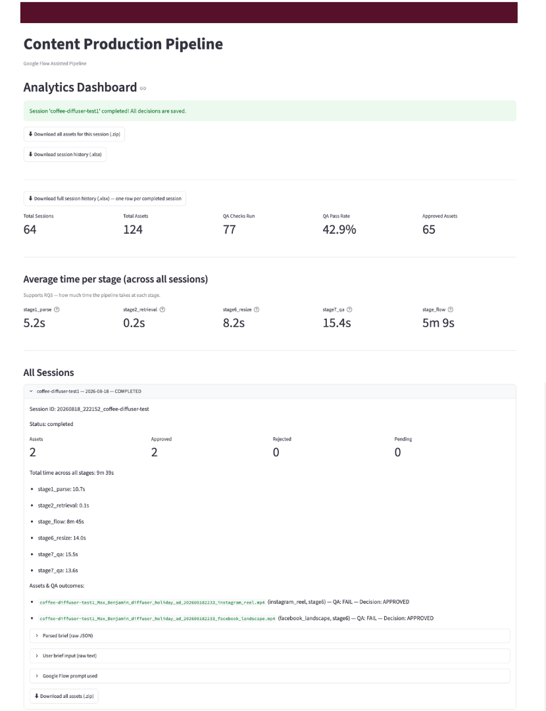

## The problem

An Irish design and retail brand - sixteen stores, sixty years old — had committed to a content strategy its production capacity could not sustain. Video was needed across more than eighteen digital touchpoints, each with its own format specification, and all of it was produced manually by a single in-house designer.

Fifteen to sixteen hours went into one video. Then that video had to be adapted, by hand, for every touchpoint it appeared on.

The question was not whether AI could generate video. It was whether AI could take the repetitive work without putting a brand built over six decades at risk.

::: {.callout-note}
## My role
Six-person consultancy team. I owned the **systematic literature review** and the **synthesis of combined research findings** — the two chapters connecting published evidence to the design decisions in the build.
:::

## What we built

An eight-stage pipeline, with a person retained at two checkpoints by design rather than as a temporary limitation.

| Stage | Function | Implementation |
|-------|----------|----------------|
| 1 | Brief parsing — free text becomes structured fields | Gemini 2.5 Flash |
| 2 | Brand retrieval — only approved assets reach generation | ChromaDB |
| — | **Human checkpoint** — the parsed brief is reviewed before anything is generated | — |
| 3–5 | Generation — video drafted, brand-conditioned from the start | Google Flow |
| 6 | Resize, logo and overlay — one asset, sixteen social and web formats | FFmpeg, Pillow |
| 7 | Automated brand check — colour compliance, logo placement, unwanted text | OpenCV, Gemini |
| 8 | **Human sign-off** — nothing publishes unreviewed | Streamlit, SQLite |

{#fig-briefparser fig-alt="Brief parser screen showing a structured JSON breakdown of a campaign brief alongside the brand rules retrieved for that campaign."}


Stages 3 to 5 are grouped because they run inside a commercial tool with no public API. Generation is triggered manually and the completed file is picked up by a folder watcher — which is also why regeneration is expensive, and therefore why the human checkpoint sits at stage 2, before any generation cost is incurred.

{#fig-resize fig-alt="Resize and overlay screen showing format selection, logo placement options, and a confirmation that output files were created."}

Every stage writes its own duration to a local database, so the evaluation data came out of the pipeline itself rather than from separate timing.

### The brand check

The most interesting engineering problem was not generation but verification. Generated video routinely contained text baked into the frame — a wordmark, a price overlay — which is a defect, because text and logos are composited separately in post-production.

A model asked simply "does this look on brand?" will pass legible, well-placed text. The instruction has to be explicit that any rendered text is a failure regardless of how good it looks:

```python
'For "unwanted_text_detected": set true if the video contains ANY rendered '
'text, words, or wordmarks (including brand name text) baked into the footage '
'itself. Text and logos are composited separately in post-production, so any '
'text generated directly into the footage is a defect, not a pass. If '
'unwanted_text_detected is true, overall_pass must be false and this must '
'appear in issues_found.'
```

A second grounding problem: the checker returned "fail" for a missing logo on formats where no logo had been applied. The fix was to tell the model what the pipeline had actually done, rather than let it infer from pixels:

```python
def _logo_context_line(logo_info, subject='image'):
    """Tell the model whether a logo was already composited by Stage 6,
    and where. Without this it guesses from pixels whether a logo is
    expected at all, producing inconsistent verdicts for the same source
    asset across different output formats."""
    if logo_info:
        return (f'A logo has already been composited onto this {subject} by an '
                f'automated step, at position: {logo_info}. Confirm it is present '
                'and correctly placed, rather than guessing whether a logo should '
                'exist at all.')
    return (f'No logo was composited onto this {subject} for this delivery, so '
            'logo-related fields should reflect that no logo is expected here.')
```

{#fig-signoff fig-alt="Sign-off review screen showing a generated video thumbnail with approve and reject buttons, and a count of approved, rejected, and pending assets."}

## Results

A single end-to-end session, measured by the pipeline's own timing. Generation was the most variable stage: this run took 8m 45s, against a development-wide average of roughly 5 minutes.

| Stage | Duration |
|-------|----------|
| Brief parsing and asset retrieval | 10.8s |
| Content generation | 8m 45s |
| Resizing across all formats | 14.0s |
| Automated brand QA | 15.5s |
| **Total** | **9m 39s** |

{#fig-analytics fig-alt="Analytics dashboard showing 64 total sessions, 124 assets, a 42.9% QA pass rate, 65 approved assets, and average time per pipeline stage."}

Generation dominates; everything built around it runs in seconds. That distribution is the finding in miniature — the model is not the slow part.

Against the manual baseline:

| | Before | After |
|---|--------|-------|
| Video production | 16 hrs | minutes |
| Multi-format resizing | 2–4 hrs | ~22s |
| QA and sign-off | 24 hrs | pre-screened report |

> "The quality looks really good — very, very strong compared to other apps I've used."
>
> — Content Manager, client side

## Why this option

Three build options were evaluated against cost, speed and maintainability.

| | Option A — Hybrid API | Option B — Standalone tool | **Option C — Assisted pipeline** |
|---|---|---|---|
| Automation | Highest | Generation only | High |
| Build time | 15–20 days | 4–6 days | **10–15 days** |
| IT burden | Highest — GPU infrastructure | Low | **Low to medium** |
| Bottlenecks resolved | 4 | 1 | **4** |

Option A had the strongest brand conditioning but required GPU infrastructure the client's IT team would have to maintain — directly against their stated goal of reducing IT workload. Option B was fastest to deploy but left resizing, the largest single time cost, completely unaddressed.

Option C was selected: it resolves all four confirmed bottlenecks at the lowest maintenance burden, and fits the client's existing cloud environment.

## How we knew what to build

None of the design above was a preference. The project followed **Design Science Research** (Hevner et al., 2004), which suits work whose output is a built artefact rather than an explanation, and four evidence streams fed every decision in it:

| Stream | What it established |
|--------|--------------------|
| Systematic literature review — 45 studies | What these architectures can reliably do today |
| Semi-structured interviews — 7 participants | What stakeholders actually needed |
| Process mapping (BPMN 2.0) — 9 stages | Where the time is lost in the current workflow |
| Requirements traceability matrix | Which feature satisfies which requirement |

Eight design decisions were documented, each cross-checked against the streams before it entered the build. Six of the eight were supported by all three evidence sources.

### The literature review

I ran the review following **Okoli's eight-step procedure**, with **PRISMA 2020** governing the search and screening and **systematic mapping** (Petersen et al., 2008) as the synthesis method.

The search combined two keyword clusters — one for architectures (RAG, LLMs, transformer models, diffusion), one for the content-creation task (text-to-video, automated editing) — requiring a match from each, so a transformer paper with no content application would not return.

{#fig-prisma fig-alt="PRISMA-style flow diagram showing the study selection process from 1,799 records to 45 included studies, with exclusion counts and reasons at each stage."}

Three eligibility criteria had to pass: a technically grounded architecture described in detail, video or multimodal output demonstrated experimentally, and evidence of real-world applicability. Every exclusion was recorded against the criterion it failed, so the selection is transparent and repeatable.

Each included study was then characterised against six predefined attributes using a shared codebook, producing the taxonomy the design decisions were drawn from.

### What the evidence told us

**Resizing was the biggest drain on capacity.** Two to four hours per asset, repeated across eighteen-plus formats. Named as the dominant bottleneck by the client's own staff, and independently by a marketing professional in an unrelated sector.

**The bottleneck was approval, not generation.** Twenty-four hours went into QA and sign-off, with no tooling supporting it at all. Three interviewees independently reframed the problem this way.

**The technology is solved; the governance is not.** Across the 45 studies, generating video works — that question is settled. Keeping a human meaningfully in control appeared in only ten of them, almost always as a secondary concern. Every person interviewed called human approval non-negotiable.

::: {.callout-tip}
## The conclusion the project turned on
Generating content was never the hard part. Keeping it on brand is — and that is where the human stays.
:::

## Limitations

Named rather than hidden. Each has an owner and a route forward.

| Limitation | Mitigation |
|------------|-----------|
| Visible watermark on generated video | Confirming commercial-use removal with the vendor |
| One step still requires a manual handoff | Automatable once a public API exists |
| Resizing uses blur fill rather than true scaling | Revisit as outpainting quality improves |
| Generation relies on a single provider | Swappable component, no rebuild required |
| Brand QA reflects our best read of the guidelines | Refine against the client's official checklist |

The automated brand check passed a minority of outputs on first attempt. Over half of those failures traced to a single cause — text already present in the source product photography rather than generated by the model. That is a finding, not a failure: it locates where the automation boundary sits, and it is why the human checkpoint is structural rather than provisional.

