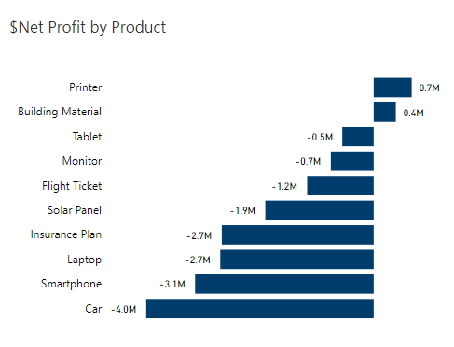
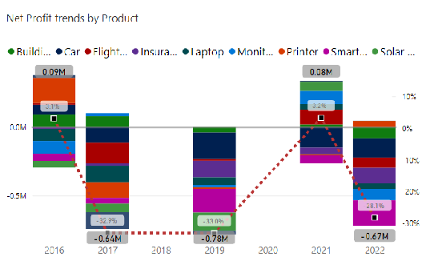
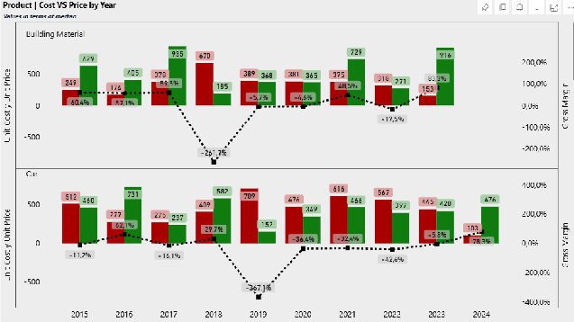

## The problem

AutoMotion Co.'s dataset covers nine years of transactions (January 2015 – July 2024): 500 rows across 19 variables, spanning five regions (Africa, Asia, Europe, North America, South America) and ten product lines. Over that period the company's average net margin was **-12.8%**, and the team was asked to work out why, using the statistical and analytical methods from the BAA1089 module.

::: {.callout-note}
## My role
Four-person team project for **BAA1089 – Statistical Models and Methods for Business Analytics**. I was responsible for the product-level analysis: net profit by product, year-over-year profit trends, and unit cost vs. unit price behaviour across all ten products, built in **Power BI**.
:::

## Which products actually made money

{#fig-netprofit fig-alt="Waterfall chart showing net profit by product from 2015 to 2024, with Printer and Building Material positive and Car and Smartphone strongly negative."}

Printer and Building Material were the only two products with a positive net profit over the full period, at $0.7M and $0.4M respectively. Car and Smartphone were the worst performers, at -$4.0M and -$3.1M.

## How that played out year by year

{#fig-trends fig-alt="Stacked column chart with a trend line showing net profit margin fluctuating between roughly +3% and -33% across 2016 to 2022, with only 2016 and 2021 positive."}

Net profit margin fluctuated between roughly +3.1% and -32.9% across the period, and only two years, 2016 and 2021, came out positive. Building Material had the fewest fluctuations and performed the most consistently. Car and Smartphone underperformed in most years, with losses reaching -$766k (-25.61% of 2022 net profit) and -$960k (-25.20% of 2019 net profit) respectively.

## Pricing vs. cost, product by product

Individual sales showed extreme outliers in unit price and unit cost, so I used the median rather than the mean to keep the year-by-year comparison meaningful.

{#fig-costprice fig-alt="Paired bar charts comparing unit cost and unit price by year for Building Material and Car, with a gross margin percentage line overlaid, showing sharp negative swings in certain years."}

The pattern repeats across products: prices regularly fell below cost. The worst cases were Car in 2019 (-367.13% gross margin), Laptop in 2015 (-382.86%), and Building Material in 2018 (-261.68%). Three products, Printer, Tablet, and Insurance Plan, held a mostly positive gross margin trend across the period, with only isolated dips (Printer and Tablet in 2017, Insurance Plan in 2024).

## What this pointed to

Reading the three views together: it isn't that AutoMotion Co.'s costs were out of control, it's that pricing wasn't tracking cost closely enough, on specific products, in specific years. That distinction matters for what you'd actually recommend: an across-the-board price increase would overcorrect for the products that were already healthy, while a blanket cost-cutting push would miss that the real exposure sits in a handful of products and years, not the business as a whole.

The team's recommendation, based on this and the parallel regional analysis, was a differentiated pricing strategy by product and region, reviewed against these indicators on a regular cycle, rather than a single company-wide price or cost adjustment.

## Tools

**Power BI** for all visualisation (waterfall, stacked column with trend overlay, paired small-multiple bar charts with dual axes), working from a 500-row, 19-column dataset. Median-based comparison was used throughout the product analysis to keep outliers in individual transactions from skewing the year-by-year picture.
