## The problem

AutoMotion Co.'s dataset covers nine years of transactions (January 2015 – July 2024): 500 rows across 19 variables, spanning five regions (Africa, Asia, Europe, North America, South America) and ten product lines across sectors including Construction, Agriculture, Tourism, Finance, Healthcare, and Electronics. Over that period the company's average net margin was **-12.8%**, and the team was asked to work out why, using the statistical and analytical methods from the BAA1089 module.

::: {.callout-note}
## My role
Four-person team project (with Wendy Lucio, Milena Magnano, and Soraya Shirini) for **BAA1089 – Statistical Models and Methods for Business Analytics**. I worked on the Power BI dashboard throughout the project, and authored the Product Level Analysis section of the report: net profit by product, year-over-year profit trends, and unit cost vs. unit price behaviour across all ten products.
:::

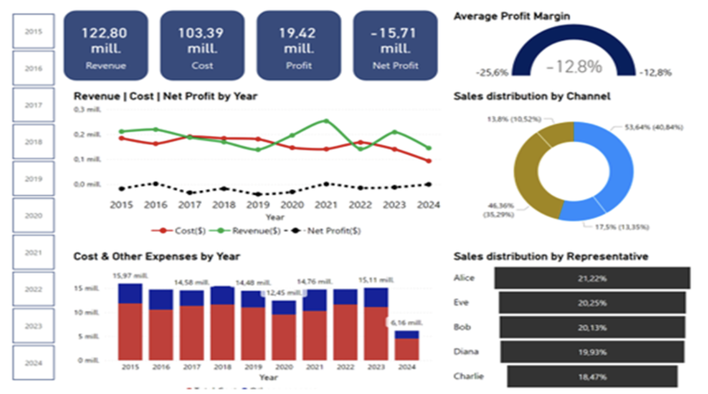{#fig-overview fig-alt="Power BI dashboard overview page showing KPI tiles for revenue, cost, profit, and net margin, a revenue/cost/profit trend line, a sales-by-channel donut chart, and a sales-by-representative bar chart."}

## Overall performance

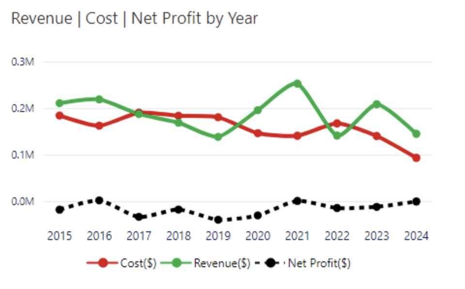{#fig-overall fig-alt="Line chart comparing total cost, total revenue, and net profit by year from 2015 to 2024, with net profit staying close to zero and dipping negative in several years."}

Yearly trend analysis showed revenue holding broadly steady from 2015 to 2024, but profit turned negative in 2017, 2019, and 2022.

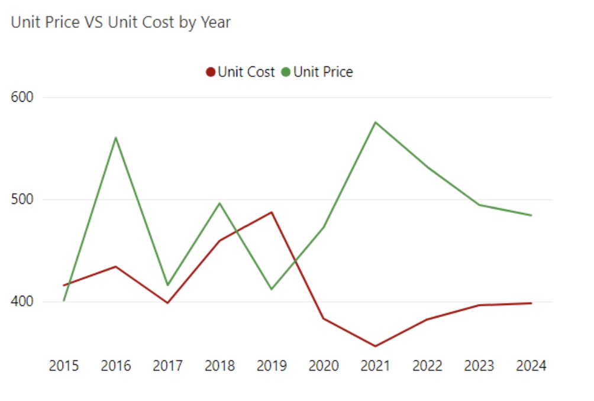{#fig-unitpricecost fig-alt="Line chart comparing unit cost and unit price by year from 2015 to 2024, with the two lines nearly converging in 2017 and 2019."}

In 2017 the average unit price was nearly equal to the unit cost, which is what caused profit to disappear that year. In 2019 cost ran slightly higher than price, again producing a loss, and in 2022 price dropped once more and squeezed margins. To investigate whether this was driven by a specific region, we looked at performance by region next.

## Regional performance

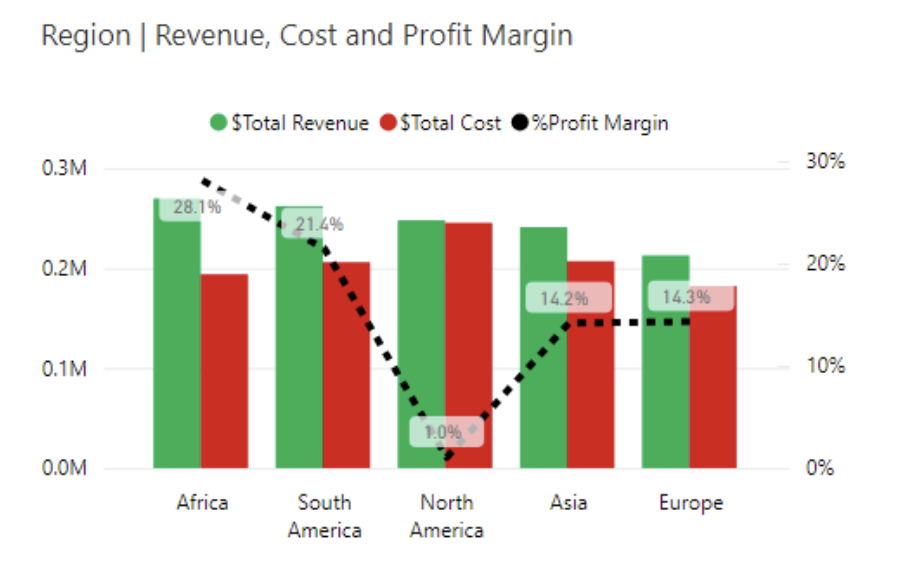{#fig-region fig-alt="Bar chart comparing total revenue and total cost by region, with a profit margin percentage line overlaid, showing Africa and South America with the highest margins and North America with the lowest."}

Revenue distribution is fairly balanced across the five regions, but profitability is not. Africa shows the highest margin at 28.1%, followed by South America at 21.4%. Europe and Asia sit in the middle (14.3% and 14.2%), while North America lags well behind at 1.0%.

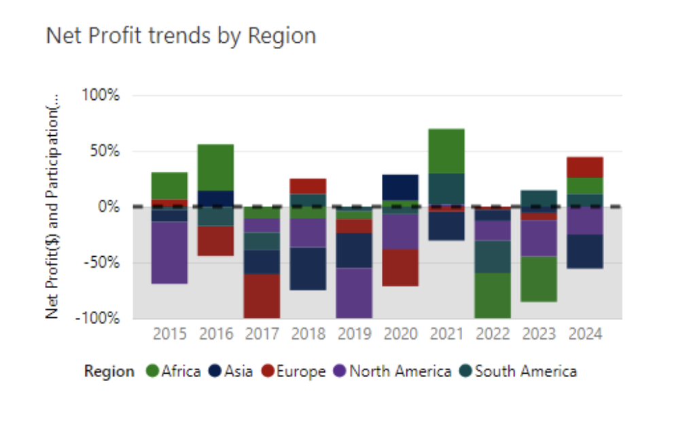{#fig-regiontrends fig-alt="Stacked bar chart showing net profit and participation percentage by region from 2015 to 2024, with Africa generally highest but dropping sharply in 2017 and 2022."}

Africa generally achieved the highest margins but experienced sharp downturns in 2017 and 2022. Profitability dropped across most regions in 2017 and 2019; the 2022 decline was driven mainly by margin drops in Africa, South America, and North America together, suggesting rising costs and pricing structure affected multiple markets at once rather than one region alone. Regional analysis explains *where* profitability varies, but not which products drive it, so the team looked at product-level performance next.

## Product level analysis

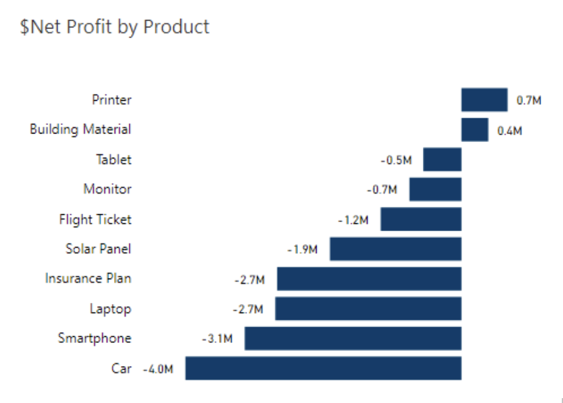{#fig-netprofit fig-alt="Waterfall chart showing net profit by product from 2015 to 2024, with Printer and Building Material positive and Car and Smartphone strongly negative."}

Printer and Building Material were the only two products with a positive net profit over the full period, at $0.7M and $0.4M respectively. Car and Smartphone were the worst performers, at -$4.0M and -$3.1M.

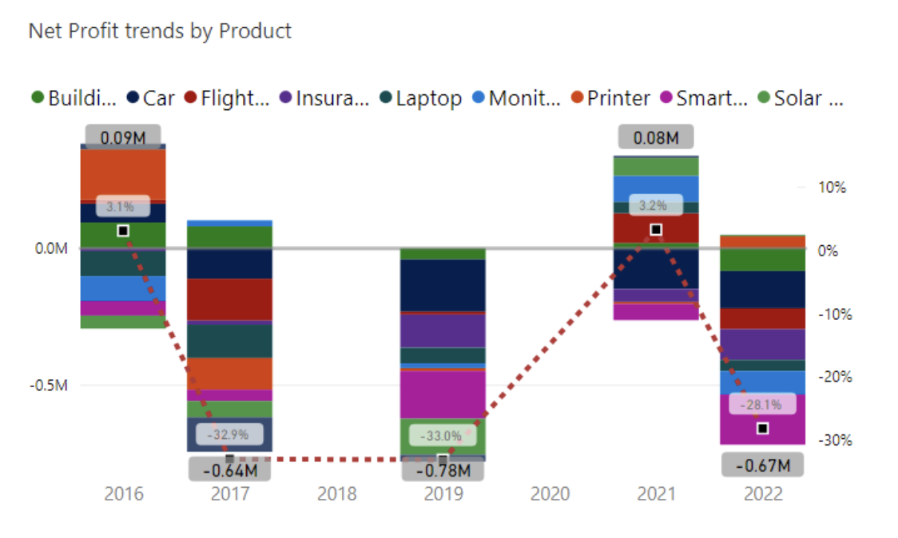{#fig-trends fig-alt="Stacked column chart with a trend line showing net profit margin fluctuating between roughly +3% and -33% across 2016 to 2022, with only 2016 and 2021 positive."}

Net profit margin fluctuated between roughly +3.1% and -32.9% across the period, and only two years, 2016 and 2021, came out positive. Building Material had the fewest fluctuations and performed the most consistently. Car and Smartphone underperformed in most years, with losses reaching -$766k (-25.61% of 2022 net profit) and -$960k (-25.20% of 2019 net profit) respectively.

Individual sales showed extreme outliers in unit price and unit cost, so the median rather than the mean was used to keep the year-by-year comparison meaningful.

::: {layout-ncol=2}
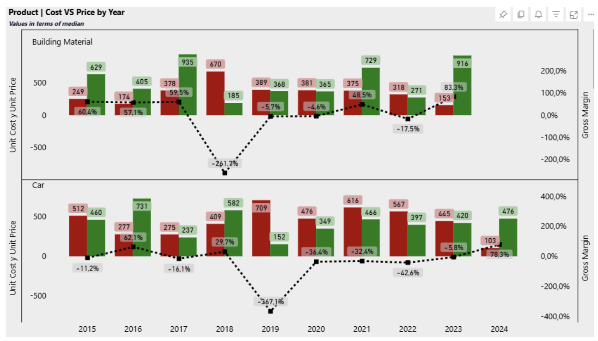{#fig-costprice1 fig-alt="Paired bar charts comparing unit cost and unit price by year for Building Material and Car, with a gross margin percentage line overlaid, showing sharp negative swings in certain years."}

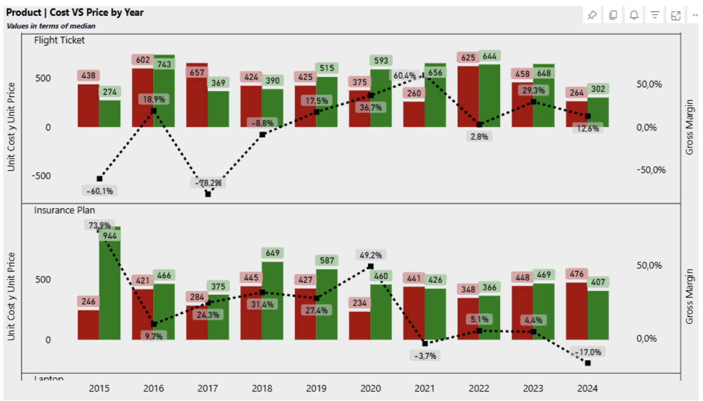{#fig-costprice2 fig-alt="Paired bar charts comparing unit cost and unit price by year for Flight Ticket and Insurance Plan, with a gross margin percentage line overlaid."}
:::

The pattern repeats across products: prices regularly fell below cost. The worst cases were Car in 2019 (-367.13% gross margin), Laptop in 2015 (-382.86%), and Building Material in 2018 (-261.68%). Three products, Printer, Tablet, and Insurance Plan, held a mostly positive gross margin trend across the period, with only isolated dips (Printer and Tablet in 2017, Insurance Plan in 2024).

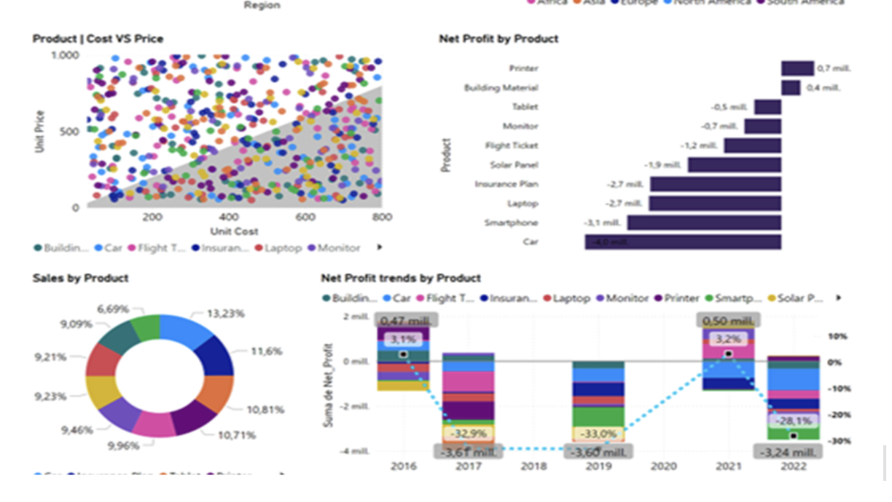{#fig-dashproduct fig-alt="Power BI dashboard page with a scatter plot of unit cost vs. unit price, a donut chart of sales by product, a bar chart of net profit by product, and a trend chart of net profit by product over time."}

## Cost performance

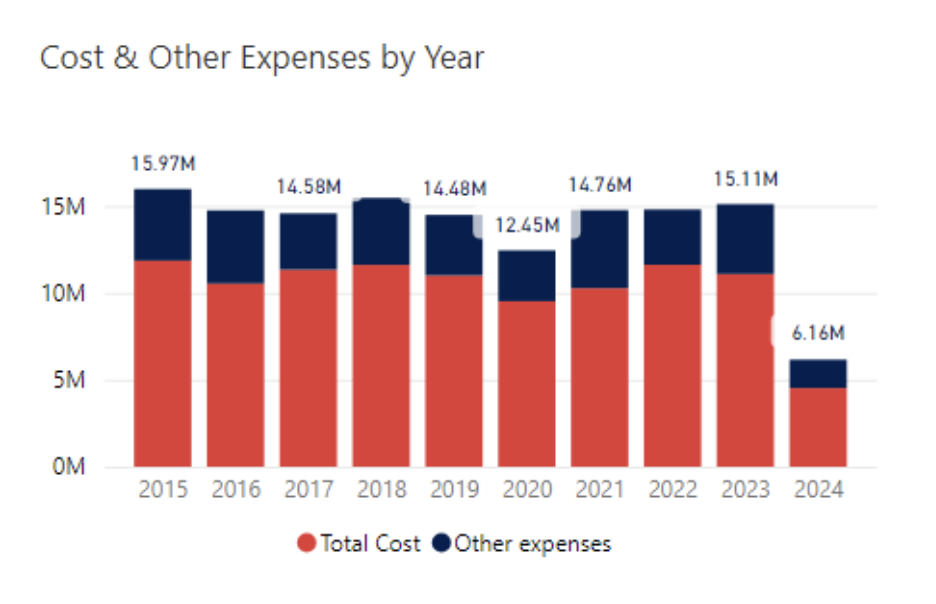{#fig-cost fig-alt="Stacked bar chart showing total cost and other expenses by year from 2015 to 2024, remaining broadly stable with a partial drop in 2024 reflecting incomplete data."}

Cost stayed broadly stable across most of the period. Shipping costs fluctuated moderately, and taxes stayed steady throughout. The main risk to profit was never a runaway cost base, it was price failing to track cost closely enough in specific products and years, as the product-level analysis above shows.

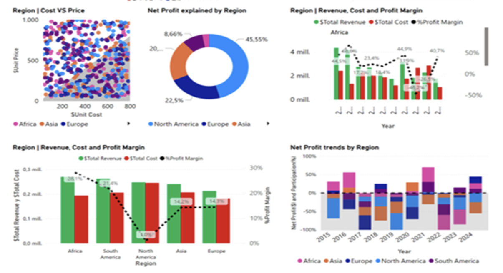{#fig-dashregion fig-alt="Power BI dashboard page with a scatter plot of unit cost vs. unit price by region, a donut chart of net profit by region, bar charts of revenue, cost and profit margin by region, and a trend chart of net profit by region over time."}

## What this pointed to

Across nine years, AutoMotion Co.'s average net margin was -12.8%. In 2017, 2019, and 2022, gross margin collapsed to near zero on specific products, driving profit margin down to -32%, -33%, and -28% respectively in those years. From 2015–2018, Flight Ticket (-60% gross margin) and Laptop (-39%) were the main drags; from 2019–2024, it was Car (-40%). Reading the regional, product, and cost views together: the company's costs were not out of control, the exposure sat in specific products, specific regions, and specific years where pricing failed to track cost, not across the business as a whole.

The team's recommendation was a differentiated pricing strategy by product and region, reviewed on a regular cycle against these indicators, rather than a single company-wide price or cost adjustment, along with exploring alternative suppliers where it wouldn't compromise product quality.

## Tools

**Power BI** for all visualisation (waterfall, stacked column with trend overlay, paired small-multiple bar charts with dual axes, scatter plots, dashboard pages combining multiple visuals), working from a 500-row, 19-column dataset. Median-based comparison was used throughout the product-level analysis to keep outliers in individual transactions from skewing the year-by-year picture.
